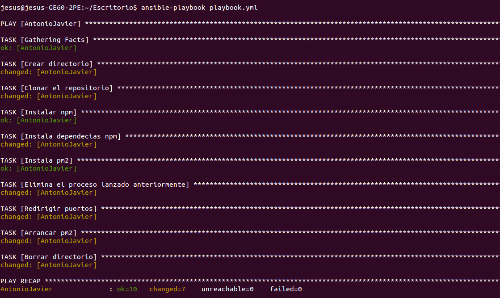
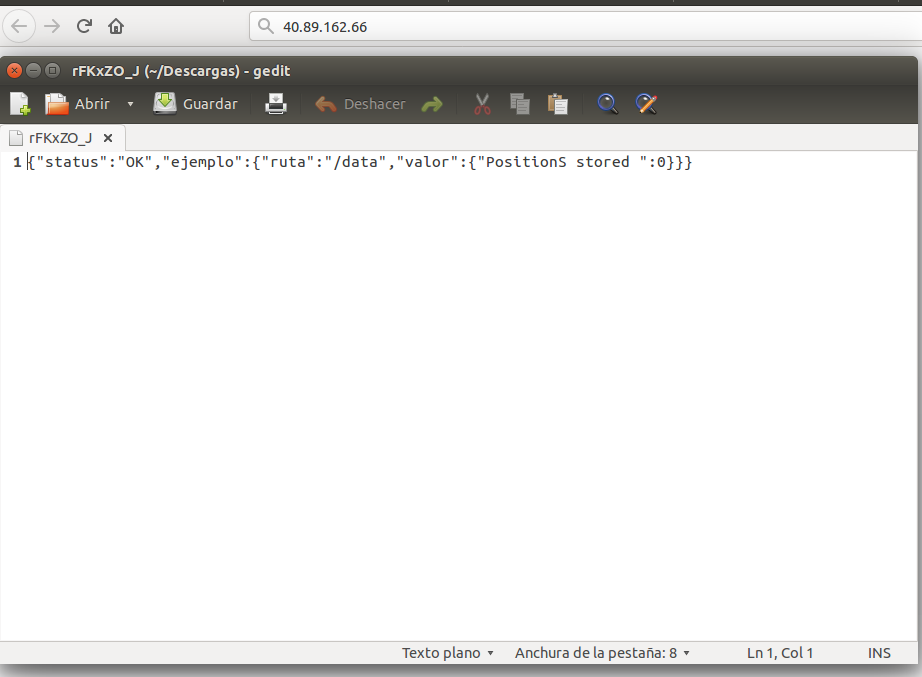

## Comprobación del provisionamiento de otro alumno

Se ha comprobado el provisionamiento realizado por [Antonio Javier Cabrera Gutiérrez](https://github.com/javiercabrera184/ProyectoCC#proyectocc). Dicho provisionamiento está orientado al despliegue de un microservicio de tracking de actividades físicas deportivas. Para ello se ha creado una máquina virtual en Azure con la misma configuración utilizada por él.

Al ejecutar desde nuestro sistema su playbook obtenemos lo siguiente.

Podemos ver en la imagen como el provisionamiento se realiza correctamente y sin errores.

Este provisionamiento realiza también el despliegue de la aplicación en la MV, por tanto, si accedemos a la IP de la misma obtenemos los siguiente.

Al acceder a la ruta / de la IP de la máquina nos descarga un fichero en formato json en el que se nos devuelve status:OK y una ruta de ejemplo. 
