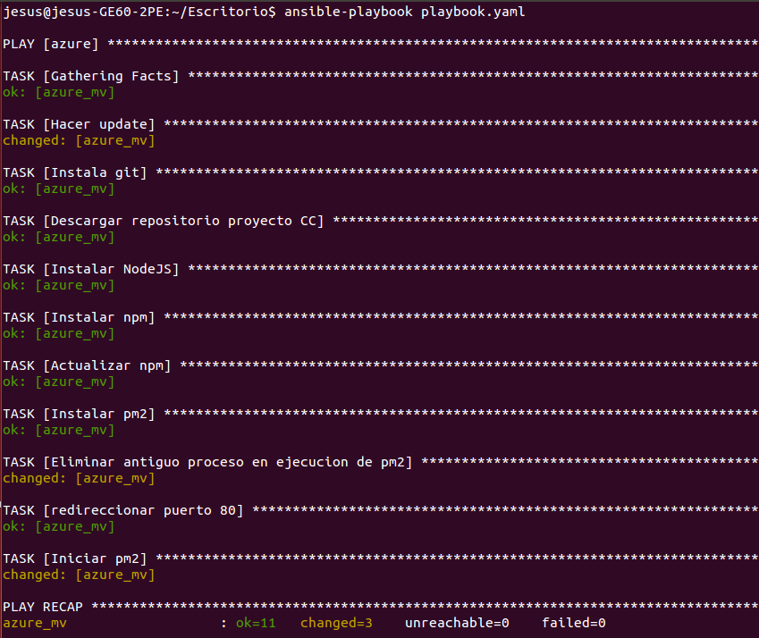
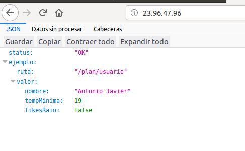

## Comprobación del provisionamiento de otro alumno

Se ha comprobado el provisionamiento realizado por Antonio Javier Rodríguez Pérez siguiendo estas [instrucciones](https://github.com/AntonioJavierRP/Cloud-Computing-Project/blob/master/docs/hito3-provisionamiento.md#11-creaci%C3%B3n-de-la-mv).

Al ejecutar desde nuestro sistema su playbook obtenemos lo siguiente.

Podemos ver en la imagen como el provisionamiento se realiza correctamente y sin errores.

Este provisionamiento realiza también el despliegue de la aplicación en la MV, por tanto, si accedemos a la IP de la misma obtenemos los siguiente.

Al acceder a la ruta / de la IP de la máquina se nos devuelve un mensaje en formato json con el par clave:valor status:OK. Esto confirma que el microservicio está desplegado correctamente y que el despliegue se ha realizado con éxito.
