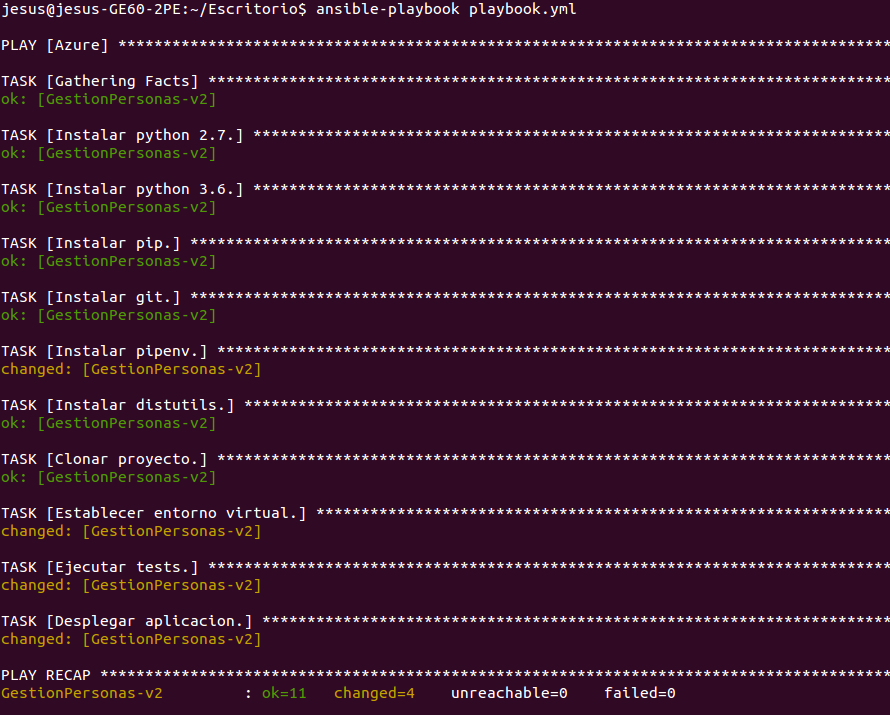
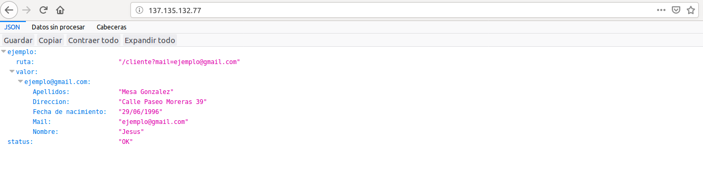

## Provisionamiento con Ansible

El provisionamiento de la máquina virtual creada en Azure se realizará mediante el gestor de
configuraciones Ansible. Se ha elegido esta herramienta debido a la sencillez que ofrece para
gestionar el provisionamiento de múltiples máquinas virtuales mediante la centralización de
en un solo fichero de los parámetros de conexión a cada una de las MVs que queremos provisionar
(el inventario).

Adicionalmente, Ansible nos permite crear de forma declarativa recetas (playbooks) en las cuales indicamos a Ansible las tareas que debe realizar en una o varias MVs.

Ansible se ejecuta desde una máquina local para realizar el provisionamiento de una o varias
máquinas remotas. Por tanto, debemos de instalar en primer lugar Ansible en el sistema local.

### Instalación de Ansible

Vamos a instalar Ansible en el sistema local (Ubuntu 14.04 en mi caso) mediante los siguientes comandos.

~~~
$ sudo apt-get update
$ sudo apt-get install software-properties-common
$ sudo apt-add-repository ppa:ansible/ansible
$ sudo apt-get update
$ sudo apt-get install ansible
~~~

A continuación debemos de añadir la MV creada en Azure al inventario de Ansible. El inventario por defecto de Ansible se encuentra en /etc/ansible/hosts. Lo abrimos y añadimos la línea siguiente.

~~~
[Azure]
GestionPersonas-v2 ansible_host=137.135.132.77 ansible_port=22
~~~

De esta forma, ponemos bajo la gestión de Ansible a nuestra máquina virtual, a la cual la hemos llamado GestionPersonas-v2 y le hemos especificado a Ansible la dirección IP y el puerto para que se pueda conectar con ella a través de ssh para provisionarla. En este caso, la MV pertenece al grupo de MVs [Azure].

A continuación, tal como se vio en el [seminario de Ansible](https://www.youtube.com/watch?v=gFd9aj78_SM) en el fichero /etc/ansible/ansible.cfg hay que descomentar la línea "host_key_cheking=False" para evitar el chequeo de la MAC de la MV cada vez que hagamos ssh a ella.

Antes de acceder con Ansible mediante ssh a la MV, debemos de crear un par clave pública/clave privada, de forma que la clave privada la ponemos en el sistema anfitrión en ~/.ssh/ en el home del usuario que vaya a ejecutar Ansible. Mientras que la clave publica tendremos que copiarla en la MV, en el archivo ~/.ssh/authorized_keys, donde ~ es el home del usuario azureuser. Este proceso ya se hace a la hora de crear la MV en el portal de Azure al copiar la clave pública en el campo pertinente.

Para probar que Ansible puede acceder mediante ssh a la MV de Azure, ejecutamos desde la máquina local

~~~
$ ansible Azure -u azureuser -m ping
~~~

Debemos de obtener el siguiente resultado si todo va bien.

~~~
GestionPersonas-v2 | SUCCESS => {
    "changed": false,
    "ping": "pong"
}
~~~

### Playbook

En este punto, ya tenemos la configuración necesaria para crear un playbook para que Ansible que realice las tareas necesarias en la MV de Azure para desplegar el microservicio de gestión de personas.

El playbook que se ha creado es el siguiente.

~~~
---
 - hosts: Azure
   user: azureuser
   become: yes
   tasks:

   - name: Actualizar los repositorios.
     apt: update_cache=yes upgrade=yes

   - name: Instalar python 2.7.
     apt: pkg=python state=present

   - name: Instalar python 3.6.
     apt: pkg=python3.6 state=present

   - name: Instalar pip3.
     apt: pkg=python3-pip state=present

   - name: Instalar git.
     apt: pkg=git state=present

   - name: Instalar pipenv.
     shell: pip3 install pipenv

   - name: Instalar distutils.
     apt: pkg=python3-distutils state=present

   - name: Clonar proyecto.
     git: repo=https://github.com/mesagon/Proyecto-CC-MII.git dest=~/Proyecto-CC-MII force=yes

   - name: Establecer entorno virtual.
     shell: pipenv install
     args:
       chdir: ~/Proyecto-CC-MII

   - name: Ejecutar tests.
     shell: pipenv run python3 test/test.py
     args:
       chdir: ~/Proyecto-CC-MII

   - name: Desplegar aplicacion.
     shell: pipenv run gunicorn --reload -D -b 0.0.0.0:80 app:app
     args:
       chdir: ~/Proyecto-CC-MII
     
~~~

Vemos que el playbook es un documento en formato yml en el cual podemos definir arrays de pares clave/valor. Cada vez que escribimos el signo - indicamos que a continuación viene un array de pares clave/valor. Podemos observar (al principio del playbook) las siguientes tres claves principales.

- hosts: El valor de esta clave es nombre de un host o el nombre del grupo de hosts en el inventario de Ansible, que queremos provisionar. Aquí queremos provisionar la MV de Azure, la cual está dentro del grupo Azure.
- user: Esta clave indica el usuario con el que debe de acceder Ansible para ejecutar las tareas de este playbook en las MVs.
- become: Indica si los comandos asociados a las tareas se ejecutan utilizando sudo.
- tasks: Esta clave tiene como valor el conjunto de tareas que debemos de ejecutar en la o las máquinas virtuales. Cada tarea se compone a su vez de los siguientes elementos:

  - name: Clave que indica el nombre descriptivo de la tarea.
  - comando: Comando a ejecutar con Ansible. Por ejemplo, apt para instalar paquetes con apt.

En el playbook podemos ver la infraestructura virtual que debemos de utilizar para desplegar el microservicio de gestión de personas. Más en concreto, al ejecutar el playbook, Ansible instalará en la MV de Azure las siguientes dependencias:

- Python 2.7 y python 3.6: La versión 2.7 necesaria para que Ansible pueda trabajar en la MV y la 3.6 es la versión de python necesaria para lanzar el microservicio.
- pip3: Para poder instalar pipenv.
- Pipenv: Para crear el entorno virtual e instalar en él las dependencias del microservicio recogidas en los ficheros Pipfile y Pipfile.lock.
- git: Para clonar el microservicio del repositorio de GitHub.

A parte de instalar las anteriores dependencias, el playbook también realiza las siguientes tareas en el orden en el que se muestran:

- Actualizar los repositorios y paquetes.
- Clonar con git el repositorio de GitHub que contiene el microservicio a desplegar.
- Instalar con pipenv las dependencias del microservicio que se encuentran en Pipfile y Pipfile.lock.
- Pasar los tests al microservicio.
- Desplegar la aplicación mediante gunicorn de forma que escuche peticiones desde todas las IPs (0.0.0.0) y en el puerto 80.

Cabe destacar que si fallan los tests, el playbook finalizará con error antes de realizar la tarea de despliegue. De esta forma se garantiza que si no se pasan los tests, la aplicación no se desplegará.

Finalmente, vamos a comprobar que el playbook funciona. Para ello, nos situamos con la terminal en el directorio donde se encuentra el playbook y ejecutamos la orden.

~~~
$ ansible-playbook <nombre_del_playbook>
~~~

En este caso hemos obtenido lo siguiente tras ejecutar la orden anterior.

Como vemos, cada una de las tareas del provisionamiento se han realizado con éxito, por tanto, nuestro microservicio debería de estar disponible para acceder a el desde el navegador poniendo su dirección IP. De esta forma, si accedemos en un navegador a la dirección http://137.135.132.77 nos aparece lo siguiente.

Vemos en la imagen como el microservicio se ha desplegado con éxito en la máquina virtual de Azure.
