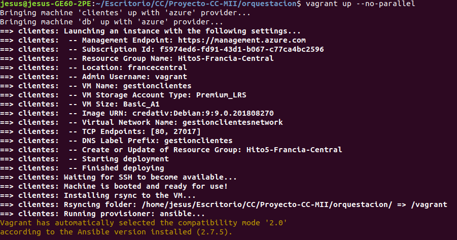
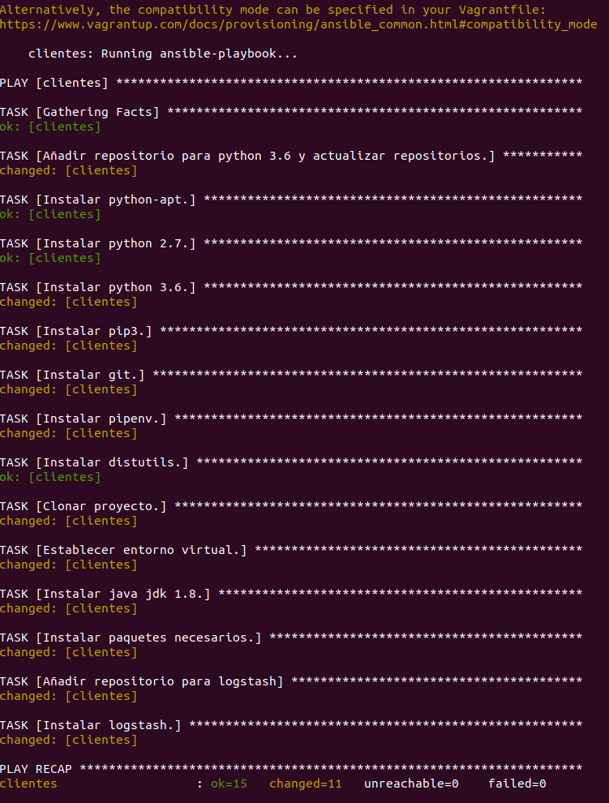
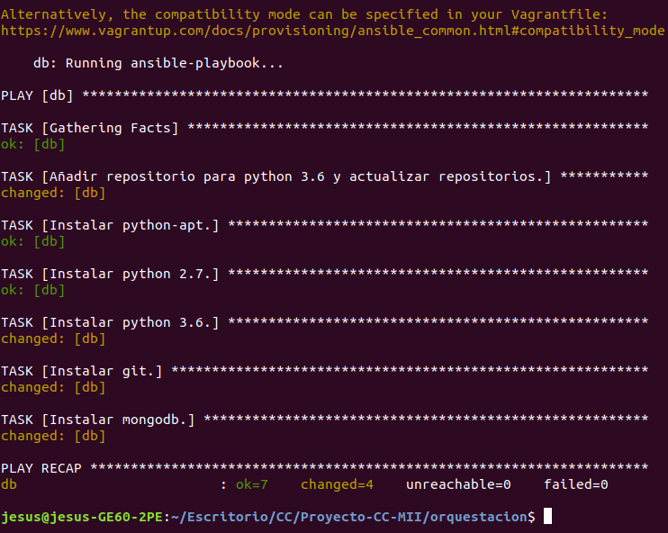

### Nueva funcionalidad implementada

Se ha utilizado mongodb para crear una base de datos no relacional destinada a almacenar en ella los datos de los distintos clientes gestionados por el microservicio de gestión de clientes. De esta forma, ahora los datos de los clientes son persistentes y perdurarán en la base de datos hasta que sean eliminados o modificados.

Por tanto, se han adaptado las clases Cliente, GestorClientes y la API REST para trabajar con mongodb utilizando la extensión de flask MongoAlchemy siguiendo este [tutorial](https://www.youtube.com/watch?v=yI2FwgunxTk) y la documentación [oficial](https://pythonhosted.org/Flask-MongoAlchemy/), de forma que ahora la adición, eliminación, modificación y consulta de clientes se realiza mediante peticiones a una base de datos mongodb en la cual se encuentran los datos de los mismos.

Esta base de datos se va a implementar en una MV aparte, de forma que la MV con el microservicio de gestión de clientes se va a conectar a dicha MV para realizar las distintas consultas. Por tanto, vamos a tener que crear dos MVs para lo cual utilizaremos Vagrant, como veremos más adelante.

La base de datos se crea en una MV independiente para de esta forma no ocupar tanto espacio en la misma MV en la que se despliega el microservicio de gestión de clientes. Además, esto permitirá que en un futuro, si añadimos más microservicios, podamos almacenar de forma centralizada los datos de todos esos microservicios en una sola MV.

Por último, cabe destacar que también se han adaptado los tests del microservicio para probar la nueva funcionalidad.

### Preparar vagrant para usarlo con Azure

Para que Vagrant pueda utilizar a Azure como proveedor para crear máquinas virtuales tenemos que instalar en él el plugin de Azure (se han seguido los pasos de [este tutorial](https://blog.scottlowe.org/2017/12/11/using-vagrant-with-azure/)). Para ello, en primer lugar debemos de instalar vagrant. Esto lo podemos hacer con [este tutorial](https://www.vagrantup.com/docs/installation/). Una vez instalado Vagrant, también debemos de asegurarnos que tenemos el cliente de línea de órdenes de Azure instalado, pues será necesario utilizarlo para configurar el plugin de Azure más adelante.

Una vez hecho todo lo anterior, instalamos el plugin de Azure en Vagrant con el siguiente comando.

~~~
$ vagrant plugin install vagrant-azure
~~~

Una vez instalado el plugin debemos añadir una caja que pueda ser utilizada por Vagrant. En este caso, cuando utilizamos Vagrant con Azure la caja utilizada es una "dummy box" que realmente no hace nada y en realidad utilizaremos en su lugar para la MV una imagen proporcionada por Azure.

Podemos añadir la "dummy box" con el siguiente comando.

~~~
$ vagrant box add azure-dummy https://github.com/azure/vagrant-azure/raw/v2.0/dummy.box --provider azure
~~~

Con este comando añadimos una dummy box para el proveedor azure (opción --provider) proporcionada por Microsoft Azure en su repositorio de GitHub y le llamamos azure-dummy (así es como la identificaremos).

Finalmente, deberemos de utilizar el cliente de línea de órdenes de Azure para crear un "Service principal" para Vagrant, que es un certificado con el que podremos otorgar una serie de permisos a Vagrant para acceder a los recursos de nuestro directorio activo de Azure (Azure active directory). Dicho service principal lo creamos con el siguiente comando (antes tenemos que logearnos con az login).

~~~
$ az ad sp create-for-rbac
~~~

Con este comando, estamos creando un service principal con el rol de contribuidor, permitiéndole crear recursos en nuestro AD (Active directory) de Azure. Una vez ejecutado este comando nos devolverá un JSON en la terminal con los valores appId, displayName, name, password y tenant. De estos valores appId, password y tenant son utilizados para la autenticación del service principal, mientras que name y displayName se utilizan para referenciar el service principal.

Posteriormente, tendremos que proporcionar mediante variables de entorno, los datos del service principal creado al Vagrantfile para que Vagrant los pueda utilizar de cara a acceder a Azure para crear las MVs.

### Elección de la imagen y del grupo de recursos

 Si recordamos, según lo expuesto en el [hito anterior](https://github.com/mesagon/Proyecto-CC-MII/blob/master/docs/hito4/eleccionSo.md) elegimos una imagen con Debian 9 para una MV de Azure en la que desplegamos el microservicio de gestión de clientes. Esta elección se realizó comparando 4 imágenes con SO base, es decir, sin ninguna característica extra añadida. Por tanto, en base a toda la experimentación anterior vamos a volver a utiliza la misma imagen con Debian 9 para las dos máquinas virtuales que tenemos que crear (microservicio de gestión de clientes y base de datos)

 Por otra parte, volveremos a utilizar un grupo de recursos situado en Francia central para alojar ambas MVs basándonos en las pruebas de distintos centros de datos realizadas en el hito anterior [aqui](https://github.com/mesagon/Proyecto-CC-MII/blob/master/docs/hito4/eleccionCentroDatos.md).

### Creación y provisionamiento de la máquina virtual de gestión de clientes

Para crear las dos MVs con Debian 9 en Azure utilizando Vagrant se ha creado un Vagrantfile, que es un fichero de configuración de Vagrant escrito en Ruby que contiene toda la configuración necesaria para orquestar la creación y provisionamiento de una o varias máquinas virtuales.

En este caso, se ha seguido [este tutorial](https://blog.scottlowe.org/2017/12/11/using-vagrant-with-azure/) para crear el Vagrantfile. Dicho esto, vamos a ver poco a poco la parte del Vagrantfile en la cual se crea y provisiona la MV del microservicio de gestión de clientes.

En primer lugar, el Vagrantfile debe importar el plugin "vagrant-azure" que permitirá a Vagrant trabajar con Azure como proveedor para crear MVs. Esto se hace con

~~~
require 'vagrant-azure'
~~~

A continuación empieza la configuración de Vagrant para crear la máquina virtual con las siguientes líneas.

~~~

Vagrant.configure('2') do |config|

	config.vm.define "clientes" do |clientes|

  	   clientes.vm.box = 'azure-dummy'
		   clientes.ssh.private_key_path = '~/.ssh/id_rsa'
~~~

Vemos como en primer lugar establecemos la versión del API de Vagrant a utilizar, que en este caso es la 2, tras esto, definimos una MV con el nombre clientes (ese es el nombre con el que Vagrant identificará a esta MV, en Azure puede tener otro nombre) y después indicamos que la caja a utilizar para la máquina virtual es la caja 'azure-dummy' añadida a nuestro sistema y explicada en la sección inicial de este mismo documento. A continuación, indicamos a Vagrant la ruta hacia nuestra clave privada la cual utilizará Vagrant para poder conectarnos mediante ssh a la MV.

A continuación, pasamos a configurar el proveedor de Azure para Vagrant para crear la MV con las siguientes líneas.

~~~
      clientes.vm.provider 'azure' do |az, override|

    			az.tenant_id = ENV['AZURE_TENANT_ID']
    			az.client_id = ENV['AZURE_CLIENT_ID']
    			az.client_secret = ENV['AZURE_CLIENT_SECRET']
    			az.subscription_id = ENV['AZURE_SUBSCRIPTION_ID']
~~~

Si nos fijamos, en primer lugar indicamos que vamos a utilizar el proveedor de Azure para crear la MV (clientes.vm.provider "azure"), después de esto establecemos cuatro parámetros del proveedor de Azure los cuales son tenant_id, client_id, client_secret y subscription_id. Estos son los parámetros del service principal que debe de utilizar Vagrant para poder conectarse a nuestra cuenta de Azure para poder crear recursos en ella. Cada uno de estos parámetros se corresponde con el valor de una de las claves del fichero JSON obtenido tras la creación de service principal. Este fichero JSON ya se comentó al inicio de este documento. Dicha correspondencia es la siguiente.

- tenant_id: Se corresponde con el valor de la clave "tenant" del fichero JSON.
- client_id: Se corresponde con el valor de la clave "client_id" del fichero JSON.
- client_secret: Se corresponde con el valor de la clave "password" del fichero JSON.
- subscription_id: Se corresponde con el id de la subscripción de Azure en la cual queremos consumir dinero para instanciar la MV. Esta id la podemos consultar haciendo $ az account list en una terminal.

Si nos fijamos, los valores de estos cuetro parámetros los toma el Vagrantfile desde variables de entorno que deberemos de exportar con la orden export antes de ejecutar el Vagrantfile. Esto se hace para evitar poner la información del service principal en el Vagrantfile que va a estar subido en Github donde cualquiera podría acceder, tomar esos datos y entrar en nuestra cuenta de Azure.

Con esto, configuramos el acceso de Vagrant a nuestra cuenta de Azure para poder crear recursos en ella. A continuación, establecemos los parámetros de la MV a crear en Azure con las siguientes líneas:

~~~
      az.vm_name = 'gestionclientes'
      az.vm_size = 'Basic_A1'
      az.vm_image_urn = 'credativ:Debian:9:9.0.201808270'
      az.resource_group_name = 'Hito5-Francia-Central'
      az.location = 'francecentral'
      az.tcp_endpoints = [80,27017]
      az.virtual_network_name = "gestionclientesnetwork"
~~~

Vamos a ver uno por uno los parámetros anteriores:

- vm_name: Es el nombre con el que se creará la MV en Azure. En este caso se denominará gestionclientes. Este nombre lo utilizará vagrant además para el DNS de la MV, por tanto debe de cumplir unas restricciones concretas.
- vm_size: Indica el tamaño de nuestra MV en Azure. En este caso hemos elegido el tamaño Basic_A1 el cual nos proporciona 1 CPU, 1,75 GB de RAM y 2 discos de datos. Se ha elegido este tamaño debido a que es el mínimo tamaño que necesitamos para desplegar el microservicio. Se quería elegir en principio el tamaño Basic_A0 (el más básico) paro solo nos proporciona 1 GB de RAM, lo cual no nos basta ya que logstash consume más memoria principal (al menos en Debian 9).
- vm_image_urn: Imagen a instalar en la MV identificada por su urn. Hemos utilizado la imagen de Debian 9, tal y como hemos dicho previamente.
- resource_group_name: Indica el nombre del grupo de recursos donde alojar la MV. Este grupo de recursos no debe de existir, siendo el propio Vagrant el que lo crea.
- location: La localización del grupo de recursos y por tanto de la MV. Se ha elegido la localización francecentral debido a lo expuesto previamente.
- tcp_endpoints: Con este parámetro indicamos los puertos o el puerto que queremos abrir en la MV (aparte del 22 para ssh que se abre por defecto). En este caso vemos que abrimos el puerto 80 a través del cual estará escuchando nuestro microservicio y el puerto 27017 para permitir tráfico entrante y saliente a través del puerto 27017, que es el puerto a través del que nos comunicaremos con la MV que tendrá la base de datos de mongo.
- virtual_network_name: Es el nombre de la red virtual a la qu pertenecerá la MV. Dicha red es gestionclientesnetwork, la cual no existe en principio pero Azure se encargará de crearla con ese nombre. Dentro de esta red también pondremos posteriormente a la MV con la base de datos, para que ambas MVs pertenezcan a la misma red privada y se puedan comunicar a través de ella sin necesidad de hacerlo de forma pública, lo cual es más seguro.

A continuación copiamos desde Vagrant una carpeta denominada "Proyecto-CC-MII" la cual se encuantra en la carpeta paresonal de mi PC local y que contiene únicamente los ficheros necesarios para realizar el despliege de la aplicación. Para ello, en el Vagrantfile se ha puesto la siguiente línea.

~~~
clientes.vm.provision "file", source: "~/Proyecto-CC-MII", destination: "~/Proyecto-CC-MII"
~~~

Con la orden clientes.vm.provision "file" podemos copiar carpetas y archivos de nuestro ordenador en el directorio deseado de la MV que estemos creando tal y como vemos [aqui](https://www.vagrantup.com/docs/provisioning/file.html).

De esta forma, evitamos tener que clonar todo el repositorio de GitHub de nuestro proyecto, en el cual hay ficheros que no son necesarios para realizar el despliegue del microservicio. Por tanto, se ha quitado del playbook de Ansible la orden para clonar el repositorio.

Por último, nos queda añadir al vagrantfile las líneas necesarias para realizar el provisionamiento de la MV de cara a instalar todas las dependencias necesarias para poder desplegar en ella el microservicio de gestión de clientes. Tal y como hemos visto en el [tema](http://jj.github.io/CC/documentos/temas/Orquestacion#provisionando-m%C3%A1quinas-virtuales) correspondiente Vagrant también permite realizar el provisionamiento de la MV creada mediante múltiples gestores de configuración. De esta forma automatizamos más aún el proceso de provisionamiento y despliegue.

El provisionamiento se realizará con Ansible y será llevado a cabo por el propio Vagrant, añadiendo al Vagrantfile las siguientes líneas.

~~~
    clientes.vm.provision "ansible" do |ansible|

      ansible.playbook = "playbook-Debian-Clientes.yml"

    end
~~~

Vemos como en la orden de provisionamiento indicamos a Vagrant que realice el provisionamiento con Ansible y tras esto, indicamos qué playbook de Ansible debe de ejecutar (es una ruta hacia el playbook de Ansible).

En este caso, no tenemos que preocuparnos de poner en el inventario de Ansible los datos de la MV a provisionar, pues Vagrant crea su propio inventario específico para la MV que va a provisionar y ejecuta Ansible con dicho inventario.

De esta forma, cuando "levantemos" la MV con Vagrant este la creará en Azure con los datos especificados en el Vagrantfile y una vez creada realizará su provisionamiento utilizando Ansible.

El playbook de Ansible utilizado para el provisionamiento es el que creamos en el anterior hito y se encuentra [aquí](). Cabe destacar que hay que poner en el playbook el valor de la clave "hosts" a all o al nombre con el que Vagrant identifica a la MV (clientes en nuestro caso). También podemos quitar el valor "user" ya que Vagrant le proporciona a Ansible el usuario con el que debe de acceder a la MV (el usuario es "vagrant" en este caso).

### Creación y provisionamiento de la máquina virtual con la base de datos

Una vez vista la parte del Vagrantfile correspondiente a la creación y provisionamiento de la MV en la que desplegaremos el microservicio de gestión de clientes, vamos a ver la parte correspondiente a la MV que contendrá la base de datos de clientes.

Esta parte es otro bloque de definición de MV similar al anterior el cual es el siguiente (la idea de hacerlo así se ha obtenido de [aquí](http://jj.github.io/CC/documentos/temas/Orquestacion#orquestando-varias-m%C3%A1quinas-virtuales)).

~~~
  config.vm.define "db" do |db|

  	db.vm.box = 'azure-dummy'
		db.ssh.private_key_path = '~/.ssh/id_rsa'

		db.vm.provider 'azure' do |az, override|

    			az.tenant_id = ENV['AZURE_TENANT_ID']
    			az.client_id = ENV['AZURE_CLIENT_ID']
    			az.client_secret = ENV['AZURE_CLIENT_SECRET']
    			az.subscription_id = ENV['AZURE_SUBSCRIPTION_ID']

    			az.vm_name = 'dbclientes'
    			az.vm_size = 'Basic_A0'
    			az.vm_image_urn = 'credativ:Debian:9:9.0.201808270'
    			az.resource_group_name = 'Hito5-Francia-Central'
    			az.location = 'francecentral'
    			az.tcp_endpoints = 27017
			    az.virtual_network_name = "gestionclientesnetwork"

  		end

  		db.vm.provision "ansible" do |ansible|

    			ansible.playbook = "playbook-Debian-DB.yml"

  		end

  end
~~~

Vemos que definimos una MV llamada "db" y con los mismos parámetros que la MV "clientes", salvo algunos parámetros correspondientes a Azure, los cuales vemos que son:

- vm_name: La MV se llamará dbclientes en Azure.
- vm_size: Se ha elegido el tamaño más básico, es decir, el Basic_A0 el cual nos proporciona 1 CPU, 0,75 GB de RAM y 1 disco de datos de 30 GB. Lo cual es suficiente para contener la base de datos de clientes en este caso particular.  
- vm_image_urn: Hemos utilizado también la imagen de Debian 9.
- resource_group_name: La Mv se alojará en el mismo grupo de recursos que la MV con el microservicio de gestión de clientes.
- location: Se ha elegido también la localización francecentral debido a lo expuesto previamente.
- tcp_endpoints: En este caso vemos que abrimos el puerto 27017 para permitir tráfico entrante y saliente a través del puerto 27017, pues la base de datos de mongo escucha a través de este puerto.
- virtual_network_name: Esta MV se encuentra en la misma red virtual que la MV anterior. De esta forma, ambas se van a poder comunicar de forma privada.

Por último, vemos que el provisionamiento de esta MV se realiza también con Ansible utilizando un nuevo playbook (playbook-Debian-DB.yml) creado específicamente para esta MV. Este playbook es el siguiente.

~~~
---
 - hosts: db
   become: yes
   tasks:

   - name: Añadir repositorio para python 3.6 y actualizar repositorios.
     apt_repository: repo="deb http://ftp.de.debian.org/debian testing main" update_cache=yes state=present

   - name: Instalar python-apt.
     apt: pkg=python-apt state=present update_cache=yes

   - name: Instalar python 2.7.
     apt: pkg=python state=present

   - name: Instalar python 3.6.
     apt: pkg=python3.6 state=present

   - name: Instalar git.
     apt: pkg=git state=present

   - name: Instalar mongodb.
     apt: pkg=mongodb
~~~

Con este playbook realizamos las siguientes tareas.

- Instalar python 2.7 (aunque viene ya instalado) y 3.6.
- Instalar git.
- Instalar mongodb para poder crear la base de datos de clientes.

### Ejecución del Vagrantfile

Una vez realizado el  Vagrantfile (el cual se encuentra [aqui](https://github.com/mesagon/Proyecto-CC-MII/blob/master/orquestacion/Vagrantfile)) "levantamos" en Azure las MVs con la siguiente orden (situándonos en el directiorio del Vagrantfile).

~~~
$ vagrant up --no-parallel
~~~

Vamos que utilizamos la opción --no-parallel. Esto hace que las MVs se creen de forma secuencial en Azure. Se ha hecho así por que Azure daba errores al crearlas en paralelo. Esta opción se ha consultado [aquí](https://www.vagrantup.com/docs/cli/up.html). Recordemos también que deberemos de exportar las cuatro variables de entorno del service principal para que vagrant pueda acceder a nuestra cuenta de Azure.

Se ha descubierto que Azure daba errores al crear las MVs al ejecutar el Vagrantfile con vagrant up. En primer lugar daba un error de IP pública no encontrada con la MV "clientes", tras esto se volvió a ejecutar y se obtuvo el mismo error con la MV "db". Entonces se puso el código de creación y provisonamiento de las dos MVs en dos Vagrantfile independientes y se ejecutó uno detrás de otro. En este último caso funcionó y de ahi se llegó a la conclusión de que Azure daba el error al tratar de crear las dos MVs en paralelo.

#### Levantando la MV con el microservicio de gestión de Clientes

Al ejecutar el Vagrantfile se creará y provisionará en primer lugar la MV en la que albergaremos el microservcio de gestión de clientes obtneiendo lo siguiente.

Vemos en la imagen como la MV del microservicio de gestión de clientes se crea en Azure con éxito con todas las características que hemos especificado en el vagrantfile.

Por otra parte, cabe destacar que el usuario de la MV con derechos de administrador se denomina vagrant. Nosotros no lo hemos especificado, es el propio Vagrant el que lo crea por defecto.

Si nos fijamos al final de la imagen, vemos como Vagrant inicia el provisionamiento de la MV con Ansible. El resultado de dicho provisionamiento lo podemos ver en la siguiente imagen.

Se puede observar en la anterior imagen que todas las tareas del playbook de provisionamiento se ejecutan correctamente.

#### Levantando la MV con la base de datos

A continuación, la ejecución del Vagrantfile continúa creando la MV que contendrá la base de datos de clientes, con lo cual obtenemos.

Vemos como la MV se crea correctamente con los parámetros especificados en el Vagrantfile y como se inicia su provisionamiento mediante Ansible, el cual resulta en lo siguiente.

Y en este caso el provisonamiento de esta MV también se realiza correctamente.

### Despliegue

Ahora tenemos dos MVs creadas en Azure y provisionadas (todo ello ejecutando una sola orden). A continuación debemos poner en marcha la base de datos y desplegar el microservicio de gestión de clientes, para lo cual tendremos que acceder mediante ssh a ambas MVs. Para ello, Vagrant nos vuelve a facilitar la vida permitiéndonos ejecutar las siguientes órdenes, las cuales deben de ejecutarse en una terminal situada en el mismo directorio en el que se encuentra el Vagrantfile.

- vagrant up <nombre MV>: Lo hemos visto antes. Nos permite "levantar" una de las dos MVs. En caso de que la MV no exista la crea, si está apagada la enciende y si está encendida no hace nada.
-vagrant suspend <nombre MV>: Apaga la MV dejándola en el estado actual. Posteriormente podremos reanudar la MV con vagrant up <nombre MV>.
- vagrant destroy <nombre MV>: Elimina la MV.
- vagrant provision <nombre MV>: Ejecuta las instrucciones de provisionamiento sobre la MV, es decir, provisiona la MV.
- vagrant ssh <nombre MV>: Nos permite conectarnos a la MV mediante ssh, sin necesidad de conocer su IP (vagrant lo hace por nosotros). Por supuesto la IP se puede consultar en el portal de Azure o a través de su cliente de línea de órdenes.

Dicho esto, vamos en primer lugar a acceder a la MV que contiene la base dea datos con la siguiente orden.

~~~
$ vagrant ssh db
~~~

Con esto entraremos a la MV como el usuario vagrant. Una vez allí debemos de abrir el fichero /etc/mongodb.conf con nano y comentar la línea #bind_ip=127.0.0.1.([Documentación mongodb](https://docs.mongodb.com/manual/reference/configuration-options/)) Con esto hacemos que la base de datos de mongodb escuche peticiones desde cualquier IP externa. Una vez hecho esto, guardamos y reiniciamos el servicio de mongodb con la orden siguiente.

~~~
$ sudo service mongodb restart  
~~~

Tras esto, ya tenemos la base de datos configurada y lista para recibir peticiones. A continuación vamos al portal de Azure, seleccionamos esta máquina virtual (llamada dbclientes) y accedemos a sus opciones de red. Allí, accedemos al enlace de su IP pública, lo que nos llevará a la pantalla de configuración de su IP pública y pulsaremos en desasociar. Esto hará que la MV con la base de datos no tenga IP pública y por tanto, nadie externo podrá acceder a ella a través del puerto 27017. Será de este modo la MV con el microservicio de gestión de clientes la única que podrá aacceder a esta MV, pues accederá a través de su IP privada al encontrarse ambas en la misma red privada.

Es importante resaltar, que cada vez que queramos acceder a la MV que contiene la base de datos desde nuestro ordenador local a través de ssh, deberemos de volver a asociar la IP pública (Aunque la IP pública cambie, vagrant es capaz de percibir este cambio y seguirá siendo capaz de conectarnos a la MV).

Una vez hecho esto, salimos de esta MV para acceder a la MV con el microservicio de getión de clientes con la siguiente orden.

~~~
$ vagrant ssh clientes
~~~

Allí, en primer lugar debemos de exportar la variable de entorno IP_MONGODB, de la cual nuestro microservicio obtiene la IP del servidor donde se encuentra la base de datos de mongodb. Dicho servidor es la MV en la cual almacenamos la base de datos y su IP es 10.0.0.4, que es su IP privada. Esta IP se puede consultar en el Portal de Azure o desde el cliente de línea de órdenes. Entonces hacemos lo siguiente.

~~~
$ export IP_MONGODB=10.0.0.4
~~~

Una vez hecho esto, podemos ejecutar los tests del microservicio.

~~~
$ pipenv run python3 test/test.py
~~~

Vemos como los tests se ejecutan correctamente. A continuación ejecutamos gunicorn para desplegar el microservicio.

~~~
$ pipenv run gunicorn --log-config gunicorn-logging.conf --reload -D -b 0.0.0.0:80 app:app
~~~

Con este comando lanzamos mediante gunicorn el microservicio. Aquí vemos los siguientes parámetros:

- log-config: En este parámetro indicamos el archivo de configuración de logs que debe utilizar gunicorn. En este caso le pasamos el fichero gunicorn-logging.conf que hemos creado para que los logs de gunicorn se envíen a logstash.
- reload: Sirve para redesplegar el microservicio en caso de que se modifique.
- D: Lanza gunicorn como un proceso demonio.
- -b: IP y puerto por los que escuchar. 0.0.0.0 significa que aceptamos peticiones desde cualquier IP.
- app: Nombre del archivo donde se encuentra el microservicio a ejecutar.

Una vez desplegado el microservicio, lanzamos logstash para que realice la gestión de logs con el comando.

~~~
$ /usr/share/logstash/bin/logstash -f logstash.conf
~~~

Vemos que le pasamos a logstash con el parámetro -f el fichero de configuración, donde declaramos de donde leemos los logs y donde los almacenamos.

Tras esto, si accedemos en el navegador a la dirección IP de la MV creada (consultar dicha IP a través del CLI de Azure o a través del portal), comprobaremos que el microservicio está desplegado correctamente.

Con esto, tenemos que la MV con el microservicio de gestión de clientes es la única que puede ser accedida de forma pública y solo a través del puerto 80, pues para acceder por ssh se requiere una clave válida y en el puerto 27017 (que tiene abierto para comunicación con la base de datos) no tiene ningún servicio escuchando.

En la imagen vemos que al acceder a la IP de la MV desde el navegador, accedemos a la ruta / del microservicio, el cual nos devuelve un JSON que contiene el par clave-valor status:"OK", confirmando que el microservicio se ha desplegado correctamente.

### Notas

Como se ha visto en este documento, algunas acciones sobre las MVs, como la desasociación de la IP pública se han realizado desde el portal de Azure en lugar de realizarlas desde el Vagrantfile. Esto es debido a que Vagrant no permite realizar algunas acciones específicas (o yo no las he encontrado) a través del proveedor de Azure.

Por otra parte, la creación de la red privada de las MVs poniendo ambas en la misma red virtual se ha llevado a cabo de forma autónoma (sin mirar tutoriales) creando máquinas virtuales, asignándoles una red, mirándo sus IPs privadas y viendo si a través de de dichas IPs se podían comunicar (con ping).
