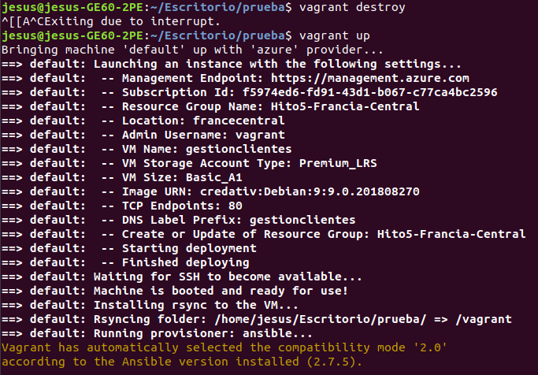
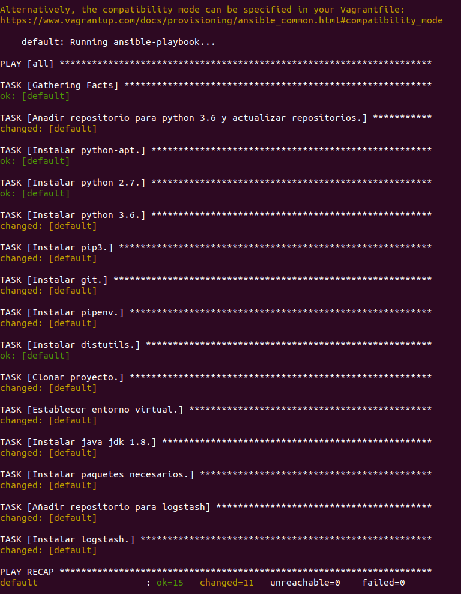
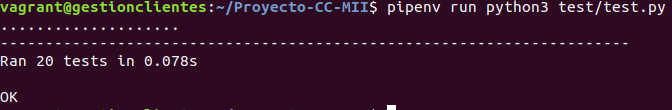
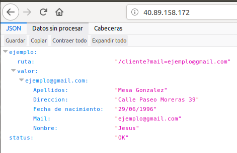

### Preparar vagrant para usarlo con Azure

Para que Vagrant pueda utilizar a Azure como proveedor para crear máquinas virtuales tenemos que instalar en él el plugin de Azure (se han seguido los pasos de [este tutorial](https://blog.scottlowe.org/2017/12/11/using-vagrant-with-azure/)). Para ello, en primer lugar debemos de instalar vagrant. Esto lo podemos hacer con [este tutorial](https://www.vagrantup.com/docs/installation/). Una vez instalado Vagrant, también debemos de asegurarnos que tenemos el cliente de línea de órdenes de Azure instalado, pues será necesario utilizarlo para configurar el plugin de Azure más adelante.

Una vez hecho todo lo anterior, instalamos el plugin de Azure en Vagrant con el siguiente comando.

~~~
$ vagrant plugin install vagrant-azure
~~~

Una vez instalado el plugin debemos añadir una caja que pueda ser utilizada por Vagrant. En este caso, cuando utilizamos Vagrant con Azure la caja utilizada es una "dummy box" que realmente no hace nada y en su lugar utilizaremos para la MV una imagen proporcionada por Azure.

Podemos añadir la "dummy box" con el siguiente comando.

~~~
$ vagrant box add azure-dummy https://github.com/azure/vagrant-azure/raw/v2.0/dummy.box --provider azure
~~~

Con este comando añadimos una dummy box para el proveedor azure (opción --provider) proporcionada por Microsoft Azure en su repositorio de GitHub y le llamamos azure-dummy (así es como la identificaremos).

Finalmente, deberemos de utilizar el cliente de línea de órdenes de Azure para crear un "Service principal" para Vagrant, que es un certificado con el que podremos otorgar una serie de permisos a Vagrant para acceder a los recursos de nuestro directorio activo de Azure (Azure active directory). Dicho service principal lo creamos con el siguiente comando (antes tenemos que logearnos con az login).

~~~
$ az ad sp create-for-rbac
~~~

Con este comando, estamos creando un service principal con el rol de contribuidor, permitiéndole crear recursos en nuestro AD (Active directory) de Azure. Una vez ejecutado este comando nos devolverá un JSON en la terminal con los valores appId, displayName, name, password y tenant. De estos valores appId, password y tenant son utilizados para la autenticación del service principal (el cual será vagrant en este caso), mientras que name y displayName se utilizan para referenciar el service principal.

Posteriormente, tendremos que proporcionar mediante variables de entorno, los datos del service principal creado al Vagrantfile para que vagrant los pueda utilizar de cara a acceder a Azure para crear las MVs.

### Elección de la imagen y del grupo de recursos

 Si recordamos, anteriormente elegimos según lo expuesto en el [hito anterior](https://github.com/mesagon/Proyecto-CC-MII/blob/master/docs/hito4/eleccionSo.md) elegimos una imagen con Debian 9 para una MV de Azure en la que desplegamos el microservicio de gestión de clientes. Esta elección se realizó comparando 4 imágenes con SO base, es decir, sin ninguna característica extra añadida. Por tanto, vamos a volver a utilizar la misma imagen con Debian 9 para la máquina virtual a crear con Vagrant.

 Por otra parte, volveremos a utilizar un grupo de recursos situado en Francia central basándonos en las pruebas de distintos centros de datos realizadas en el hito anterior [aqui](https://github.com/mesagon/Proyecto-CC-MII/blob/master/docs/hito4/eleccionCentroDatos.md).

### Creación y provisionamiento de la máquina virtual en Azure con Vagrant

Para crear la máquina virtual con Debian 9 en Azure utilizando Vagrant se ha creado un Vagrantfile, que es un fichero de configuración de Vagrant escrito en Ruby que contiene toda la configuración necesaria para orquestar la creación y provisionamiento de una o varias máquinas virtuales.

En este caso, se ha seguido [este tutorial](https://blog.scottlowe.org/2017/12/11/using-vagrant-with-azure/) para crear el Vagrantfile. Dicho esto, vamos a ver poco a poco cada uno de sus elementos viendo también de esta forma los parámetros de la MV y de su provisionamiento.

En primer lugar, el Vagrantfile debe importar el plugin "vagrant-azure" que permitirá a Vagrant trabajar con Azure como proveedor para crear MVs. Esto se hace con

~~~
require 'vagrant-azure'
~~~

A continuación empieza la configuración de vagrant para crear la máquina virtual con las siguientes líneas.

~~~
Vagrant.configure('2') do |config|

  config.vm.box = 'azure-dummy'

  config.ssh.private_key_path = '~/.ssh/id_rsa'
~~~

Vemos como en primer lugar establecemos la versión del API de Vagrant a utilizar, que en este caso es la 2, tras esto, indicamos que la caja a utilizar para la máquina virtual es la caja 'azure-dummy' añadida a nuestro sistema y explicada en la sección inicial de este mismo documento. Tras esto, indicamos a Vagrant la ruta hacia nuestra clave privada la cual utilizará Vagrant para poder conectarnos mediante ssh en la MV.

A continuación, pasamos a configurar el proveedor de Azure para Vagrant para crear la MV con las siguientes líneas.

~~~
config.vm.provider 'azure' do |az, override|

    az.tenant_id = ENV['AZURE_TENANT_ID']
    az.client_id = ENV['AZURE_CLIENT_ID']
    az.client_secret = ENV['AZURE_CLIENT_SECRET']
    az.subscription_id = ENV['AZURE_SUBSCRIPTION_ID']
~~~

Si nos fijamos, en primer lugar indicamos que vamos a utilizar el proveedor de Azure para crear la MV (config.vm.provider "azure"), después de esto establecemos cuatro parámetros del proveedor de Azure los cuales son tenant_id, client_id, client_secret y subscription_id. Estos son los parámetros del service principal que debe de utilizar Vagrant para poder conectarse a nuestra cuenta de Azure para poder crear recursos en ella. Cada uno de estos parámetros se compone con el valor de una de las claves del fichero JSON obtenido tras la creación de service principal. Este fichero JSON ya se comentó al inicio de este documento. Dicha correspondencia es la siguiente.

- tenant_id: Se corresponde con el valor de la clave "tenant" del fichero JSON.
- client_id: Se corresponde con el valor de la clave "client_id" del fichero JSON.
- client_secret: Se corresponde con el valor de la clave "password" del fichero JSON.
- subscription_id: Se corresponde con el id de la subscripción de Azure en la cual queremos consumir dinero para instanciar la MV. Esta id la podemos consultar haciendo $ az account list en una terminal.

Si nos fijamos, los valores de estos cuetro parámetros los toma el Vagrantfile desde variables de entorno que deberemos de exportar con la orden export antes de ejecutar el Vagrantfile. Esto se hace para evitar poner la información del service principal en el Vagrantfile que va a estar subido en Github donde cualquiera podría acceder, tomar esos datos y entrar en nuestra cuenta de Azure.

Con esto, configuramos el acceso de Vagrant a nuestra cuenta de Azure para poder crear recursos en ella. Tras esto, establecemos los parámetros de la MV a crear en Azure con las siguientes líneas:

~~~
    az.vm_name = 'GestionClientes'
    az.vm_size = 'Basic_A1'
    az.vm_image_urn = 'credativ:Debian:9:9.0.201808270'
    az.resource_group_name = 'Hito5-Francia-Central'
    az.location = 'francecentral'
    az.tcp_endpoints = 80
~~~

Vamos a ver uno por uno los parámetros anteriores:

- vm_name: Es el nombre con el que se creará la MV en Azure. En este caso se denominará gestionclientes. Este nombre lo utilizará vagrant además para el DNS de la MV, por tanto debe de cumplir unas restricciones concretas.
- vm_size: Indica el tamaño de nuestra MV en Azure. En este caso hemos elegido el tamaño Basic_A1 el cual nos proporciona 1 CPU, 1,75 GB de RAM y 2 discos de datos. Se ha elegido este tamaño debido a que es el mínimo tamaño que necesitamos para desplegar nuestra aplicación. Se quería elegir en principio el tamaño Basic_A0 (el más básico) paro solo nos porporciona 1 GB de RAM, lo cual no nos basta ya que logstash consume más memoria principal (al menos en Debian 9).
- vm_image_urn: Imagen a instalar en la MV identificada por su urn. Hemos utilizado la imagen de Debian 9, tal y como hemos dicho [previamente]().
- resource_group_name: Indica el nombre del grupo de recursos donde alojar la MV. Este grupo de recursos no debe de existir, siendo el propio Vagrant el que lo crea.
- location: La localización del grupo de recursos y por tanto de de la MV. Se ha elegido la localización francecentral debido a lo expuesto [previamente]().
- tcp_endpoints: Con este parámetro indicamos los puertos o el puerto que queremos abrir en la MV (aparte del 22 para ssh que se abre por defecto). En este caso vemos que abrimos el puerto 80 a través del cual estará escuchando nuestro microservicio.

Por último, nos queda añadir al vagrantfile las líneas necesarias para realizar el provisionamiento de la MV de cara a instalar todas las dependencias necesarias para poder desplegar en ella el microservicio de gestión de clientes. Tal y como hemos visto en el [tema](http://jj.github.io/CC/documentos/temas/Orquestacion#provisionando-m%C3%A1quinas-virtuales) correspondiente Vagrant también permite realizar el provisionamiento de la MV creada mediante múltiples gestores de configuración. De esta forma automatizamos más aún el proceso de provisionamiento y despliegue.

El provisionamiento se realizará con Ansible y será realizado por el propio Vagrant, añadiendo al Vagrant file las siguientes líneas.

~~~
config.vm.provision :ansible do |ansible|

  ansible.playbook = "playbook-Debian.yml"

end
~~~

Vemos como en la orden de provisionamiento indicamos a Vagrant que realice el provisionamiento con Ansible y tras esto, indicamos qué playbook de Ansible debe de ejecutar (es una ruta hacia el playbook de Ansible).

En este caso, no tenemos que preocuparnos de poner en el inventario de Ansible los datos de la MV a provisionar, pues Vagrant crea su propio inventario específico para la MV que va a provisionar (la que crea el mismo) y ejecuta Ansible con dicho inventario.

De esta forma, cuando "levantemos" la MV con Vagrant este la creará en Azure con los datos especificados en el Vagrantfile y una vez creada realizará su provisionamiento utilizando Ansible.

El playbook de Ansible utilizado para el provisionamiento es el que creamos en el anterior hito y se encuentra [aquí](https://github.com/mesagon/Proyecto-CC-MII/blob/master/provision/ansible/playbook-Debian.yml). Cabe destacar que hay que poner en el playbook el valor de la clave "hosts" a all o al nombre con el que Vagrant identifica a la MV en su inventario propio de Ansible (default en nuestro caso). También podemos quitar el valor "user" ya que Vagrant le proporciona a Ansible el usuario con el que debe de acceder a la MV (el usuario es "vagrant" en este caso).

Con todas las líneas anteriores nos queda el siguiente Vagrantfile.

~~~
require 'vagrant-azure'

Vagrant.configure('2') do |config|

  config.vm.box = 'azure-dummy'

  config.ssh.private_key_path = '~/.ssh/id_rsa'

  config.vm.provider 'azure' do |az, override|

    az.tenant_id = ENV['AZURE_TENANT_ID']
    az.client_id = ENV['AZURE_CLIENT_ID']
    az.client_secret = ENV['AZURE_CLIENT_SECRET']
    az.subscription_id = ENV['AZURE_SUBSCRIPTION_ID']

    az.vm_name = 'GestionClientes'
    az.vm_size = 'Basic_A1'
    az.vm_image_urn = 'credativ:Debian:9:9.0.201808270'
    az.resource_group_name = 'Hito5-Francia-Central'
    az.location = 'francecentral'
    az.tcp_endpoints = 80

  end

  config.vm.provision :ansible do |ansible|

    ansible.playbook = "playbook-Debian.yml"

  end

end
~~~

A continuación "levantamos" en Azure la MV con la siguiente orden.

~~~
$ vagrant up
~~~

De esta forma obtenemos lo siguiente.

Vemos en la imagen como la MV se crea en Azure con éxito con todas las características que hemos especificado en el vagrantfile. En este caso, la MV en Azure se llama gestionclientes pero vagrant la denomina localmente default.

Por otra parte, cabe destacar que el usuario con derechos de administrador se denomina vagrant. Nosotros no lo hemos especificado, es el propio Vagrant el que lo crea por defecto.

Si nos fijamos al final de la imagen, vemos como Vagrant inicia el provisionamiento de la MV con Ansible. El resultado de dicho provisionamiento lo podemos ver en la siguiente imagen.

Se puede observar en la anterior imagen que todas las tareas del playbook de provisionamiento se ejecutan correctamente.

### Despliegue del microservicio

Tras esto, tenemos una MV creada en Azure provisionada y lista para poder desplegar el microservicio en ella. Para realizar dicho despliege debemos de acceder mediante ssh a la MV. Para ello, Vagrant nos vuelve a facilitar la vida permitiéndonos ejecutar las siguientes órdenes, las cuales deben de ejecutarse en una terminal situada en el mismo directorio en el que se encuentra el Vagrantfile.

- vagrant up: Lo hemos visto antes. Nos permite "levantar" la MV. En caso de que la MV no exista la crea, si está apagada la enciende y si está encendida no hace nada.
-vagrant suspend: Apaga la MV dejándola en el estado actual. Posteriormente podremos reanudar la MV con vagrant up.
- vagrant destroy: Elimina la MV.
- vagrant provision: Ejecuta las instrucciones de provisionamiento sobre la MV, es decir, provisiona la MV.
- vagrant ssh: Nos permite conectarnos a la MV mediante ssh, sin necesidad de conocer su IP (vagrant lo hace por nosotros). Por supuesto la IP se puede consultar en el portal de Azure o a través de su cliente de línea de órdenes.

La MV recién creada está encendida y lista para acceder a ella. Accedemos pues  mediante ssh con el comando siguiente (como he dicho antes hay que situarse en el directorio donde se encuenra el vagrantfile).

~~~
$ vagrant ssh
~~~

Con esto entraremos a la MV como el usuario vagrant. Una vez allí accedemos a la carpeta Proyecto-CC-MII, que es donde se encuentra la aplicación. En primer lugar ejecutamos los tests con.

~~~
$ pipenv run python3 test/test.py
~~~

Vemos como los tests se ejecutan correctamente. A continuación ejecutamos gunicorn para desplegar el microservicio.

~~~
$ pipenv run gunicorn --log-config gunicorn-logging.conf --reload -D -b 0.0.0.0:80 app:app
~~~

Con este comando lanzamos mediante gunicorn el microservicio. Aquí vemos los siguientes parámetros:

- log-config: En este parámetro indicamos el archivo de configuración de logs que debe utilizar gunicorn. En este caso le pasamos el fichero gunicorn-logging.conf que hemos creado para que los logs de gunicorn se envíen a logstash.
- reload: Sirve para redesplegar el microservicio en caso de que se modifique.
- D: Lanza gunicorn como un proceso demonio.
- -b: IP y puerto por los que escuchar. 0.0.0.0 significa que aceptamos peticiones desde cualquier IP.
- app: Nombre del archivo donde se encuentra el microservicio a ejecutar.

Una vez desplegado el microservicio, lanzamos logstash para que realice la gestión de logs con el comando.

~~~
$ /usr/share/logstash/bin/logstash -f logstash.conf
~~~

Vemos que le pasamos a logstash con el parámetro -f el fichero de configuración, donde declaramos de donde leemos los logs y donde los almacenamos.

Tras esto, si accedemos en el navegador a la dirección IP de la MV creada (consultar dicha IP a través del CLI de Azure o a travás del portal), comprobaremos que el microservicio está desplegado correctamente.

En la imagen vemos que al acceder a la IP de la MV desde el navegador, accedemos a la ruta / del microservicio, el cual nos devuelve un JSON que contiene el par clave-valor status:"OK", confirmando que el microservicio se ha desplegado correctamente.

Despliegue Vagrant: 52.143.183.234
