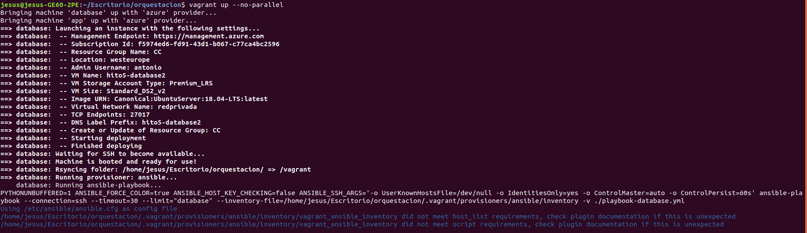
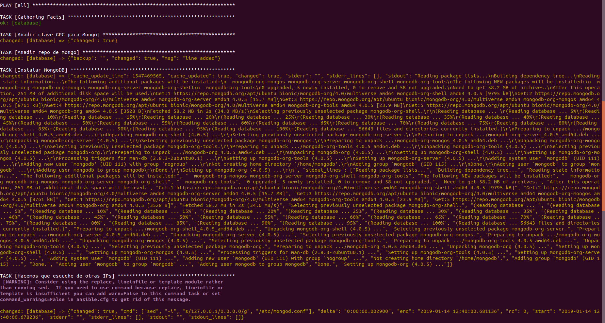
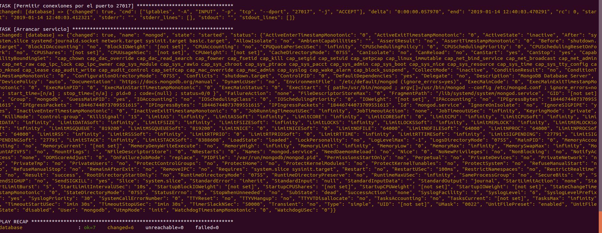
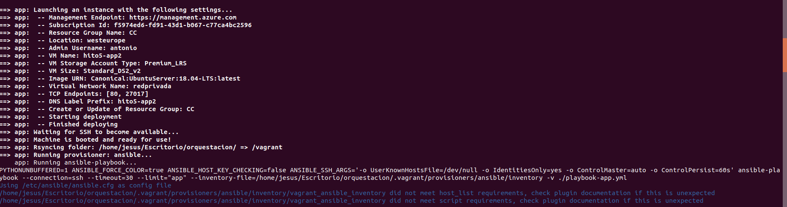
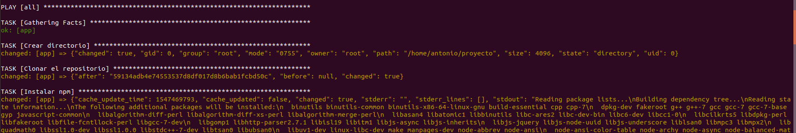
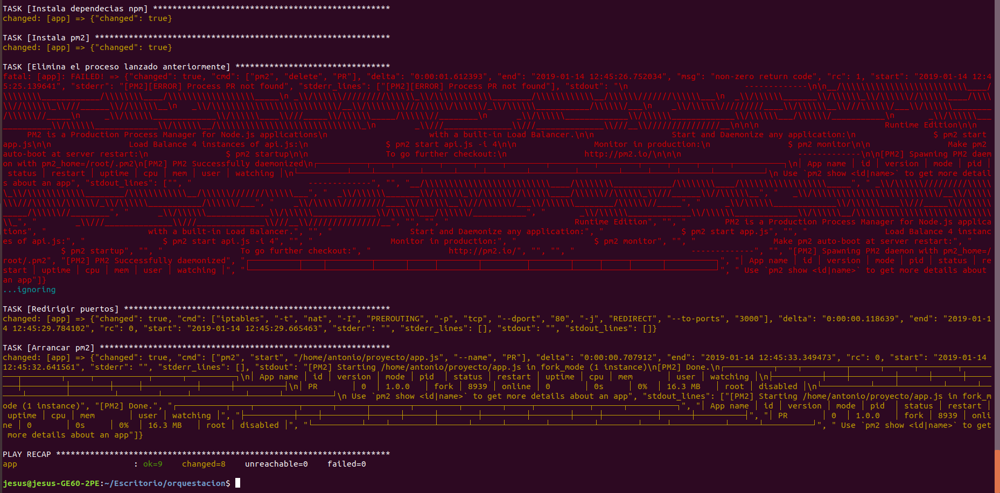
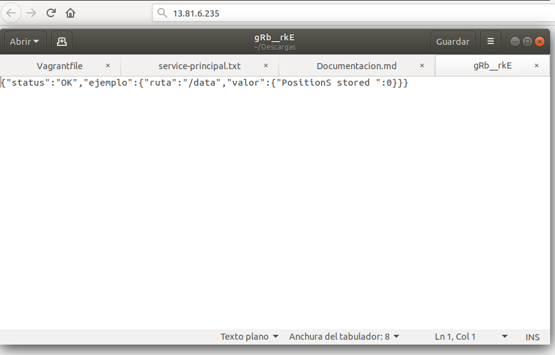

### Comprobación del Vagrantfile de Antonio Javier Cabrera Gutiérrez

Vamos ha comprobar el Vagrantfile de Antonio Javier Cabrera Gutiérrez. Para ello, nos descargamos su Vagrantfile y sus playbooks de provisionamiento, los ponemos todos en un mismo directorio, establecemos las variables de entorno necesarias para conectar con nuestra cuenta de Azure y ejecutamos vagrant up.

El vagrantfile debe crear y provisonar dos MVs, una de ellas contendrá la aplicación y la otra su base de datos.

Vemos como se crea y se provisiona correctamente la MV con la base de datos. A continuación el vagrantfile crea y provisiona la MV que contendrá la aplicación.

Finalmente, se puede observar que la MV que contendrá la aplicación también se crea y provisiona correctamente, con lo cual hemos verificado que el Vagrantfile funciona correctamente.

Ahora realizamos el despliegue y comprobamos que funciona.

Al acceder a la ruta / de la IP de la máquina nos descarga un fichero en formato json en el que se nos devuelve status:OK y una ruta de ejemplo.
