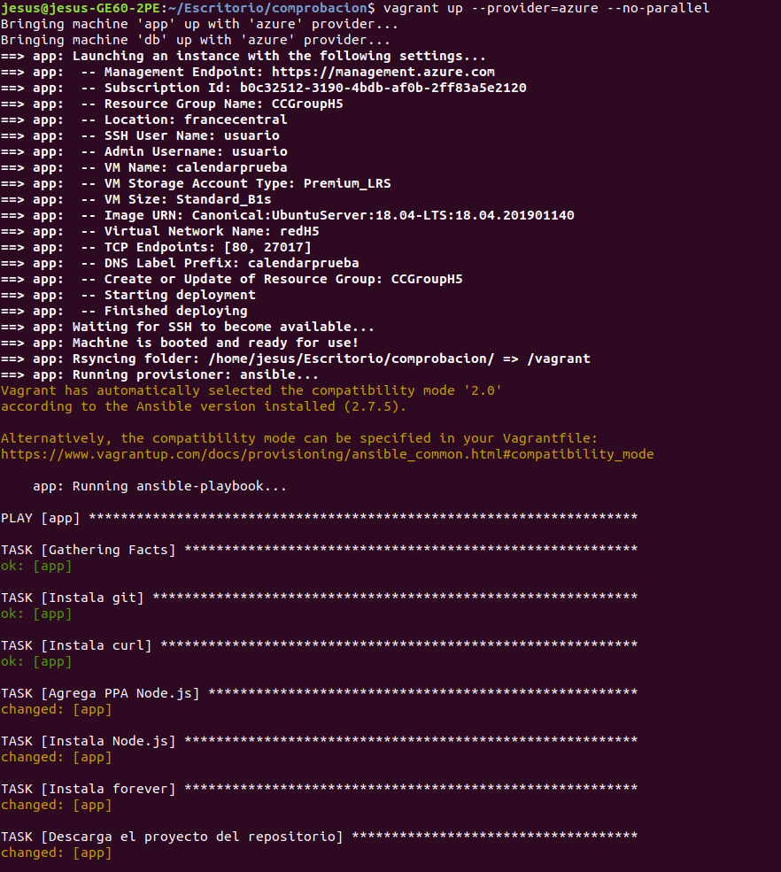
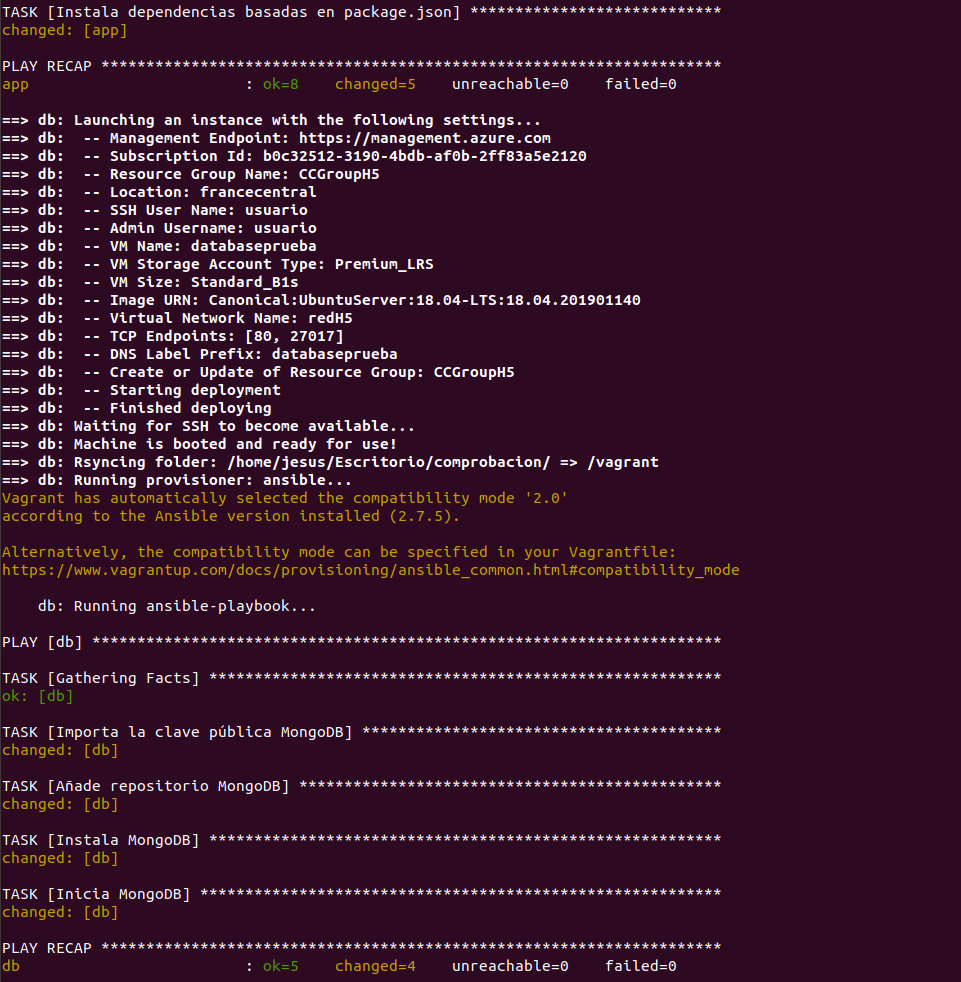
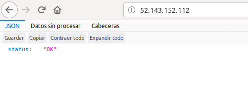

### Comprobación del Vagrantfile de Mª del Mar Alguacil Camarero

Vamos ha comprobar el Vagrantfile de Mª del Mar Alguacil Camarero. Para ello, nos descargamos su Vagrantfile y sus playbooks de provisionamiento, los ponemos todos en un mismo directorio, establecemos las variables de entorno necesarias para conectar con nuestra cuenta de Azure y ejecutamos vagrant up.

El vagrantfile debe crear y provisonar dos MV, una de ellas contendrá la aplicación y la otra su base de datos.

Para que no diese conflictos de DNS, he puesto otro nombre a las MVs añadiéndoles el sufijo "prueba". Todo lo demás está exactemente igual a como Mª del Mar lo ha hecho. Ejecutamos entonces el vagrantfile con $ vagrant up --provider=azure --no-parallel y obtenemos lo siguiente.

Vemos como ambas MVs se crean correctamente y sin problemas. Ahora, para realizar el despliegue del microservicio vamos a acceder mediante ssh a la MV que conttiene la base de datos de mongo.

~~~
$ vagrant ssh db
~~~

Una vez hemos accedido a la MV, abrimos el fichero /etc/mongod.conf y cambiamos el campo bind_ip por la ip privada (la podemos consultar en el portal de Azure, en este caso es 10.0.0.5) de la MV que contiene el microservicio, para que de esta forma la MV con la base de datos solo reciba peticiones de la MV que contiene el microservicio. Tras editar este campo, reiniciamos mongod para que los cambios surtan efecto.

~~~
$ sudo service mongod restart
~~~

A continuación accedemos por ssh a la MV que contiene el microservicio y lo desplegamos con los tres comandos siguientes.

~~~
$ vagrant ssh app
$ cd ProyectoCC
$ sudo IP_MONGO="10.0.0.5" npm start
~~~

Finalmente, al acceder desde un navegador a la IP pública de la MV que contiene el microservicio se nos devuelve un JSON con el par clave-valor status:"OK", verificando que el despliegue se ha llevado a cabo correctamente.

